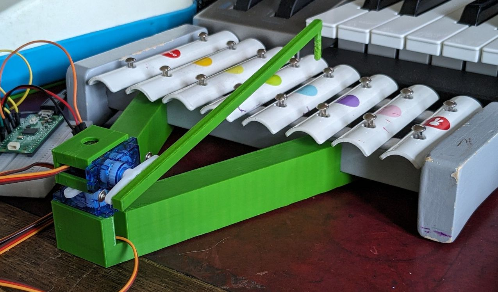

# MidiBanger
A Raspberry Pico MIDI device that plays physical (toy) instruments via servos.

MidiBanger supports both percussive (mallet-type) and pressed (key-type) instruments.

The initial version supports up to 16 directly-connected servos, later versions may
support I2C servo controllers allowing hundreds of servos to be used.  Also planned
is the ability to use solenoids rather than servos.

There is also support for a single hammer 'tilt and pan' mode using only two servos to 
play all reachable notes.



## Hardware Requirements
* Raspberry Pico or compatible such as RP2040-Zero
* Servo per note eg. SG90 9g Micro Servo, or a pair if using pan-and-tilt 
* Optional - Micro speaker - handy for debugging and setup
* Optional - 5V PSU for servos, if you think you need it
* Some 3D-printed parts to hold servos etc.

Some sample 3D parts are included in the `3D` directory, there are [FreeCAD](https://www.freecad.org/) designs and `.3mf` files
for slicing.

## Configuration
See the comments in `src/config.h` for details.

To avoid masses of commented-out congfiguration I have put the configuration that is specific to a
particular physical instrument in a separate file which is then `#include`d in the main `config.h`.
Example configurations are `chicco_toy_glock_config.h` and `janod_toy_glock_config.h`.

For the servo-per-note mode, the critical configuration item is the `NOTEPIN_INITIALISER`.  Leave its first line alone, then replace the contents with a maximum of sixteen [MIDI note number] = GPIO_PIN pairs.

For the two-servo pan-and-tilt mode it's the `NOTE_PAN_INITIALISER` that you will need to adjust to set the 
angles for each note.  This will be a trial-and-error process, I suggest you start by installing the servos so that
their centres of movement roughly point to the middle of the instrument and then do a first run WITHOUT the hammer attached.

If you are connecting up several MidiBangers I suggest you use a different string or
number for each one at the end of the `USB_PRODUCT` string.  It will make your life a lot simpler!

## Building
Don't forget to set `PICO_BOARD` to match your target microcontroller in `CMakeLists.txt`, then...
```
mkdir build
cd build
cmake ..
make
```
## Hints
### Pan-and-Tilt Players
* Try a metal-geared servo for the panning action, these seem to have less play than the plastic-geared equivalent.
* For greater accuracy playing large intervals (leaps) you can try setting the angles for the lowest and highest notes
just a little towards the centre, this will compensate for some overshoot.